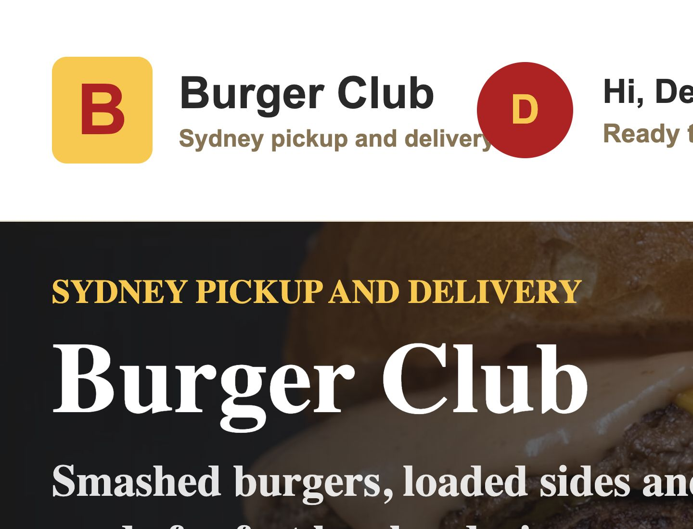
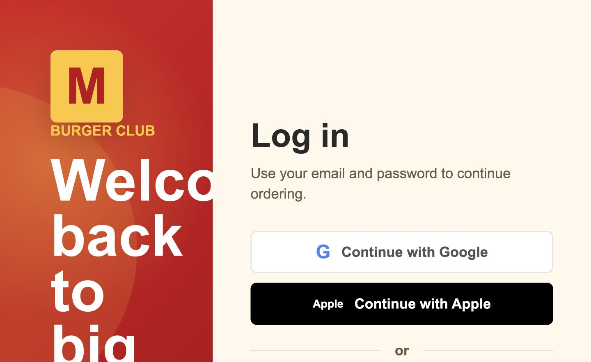
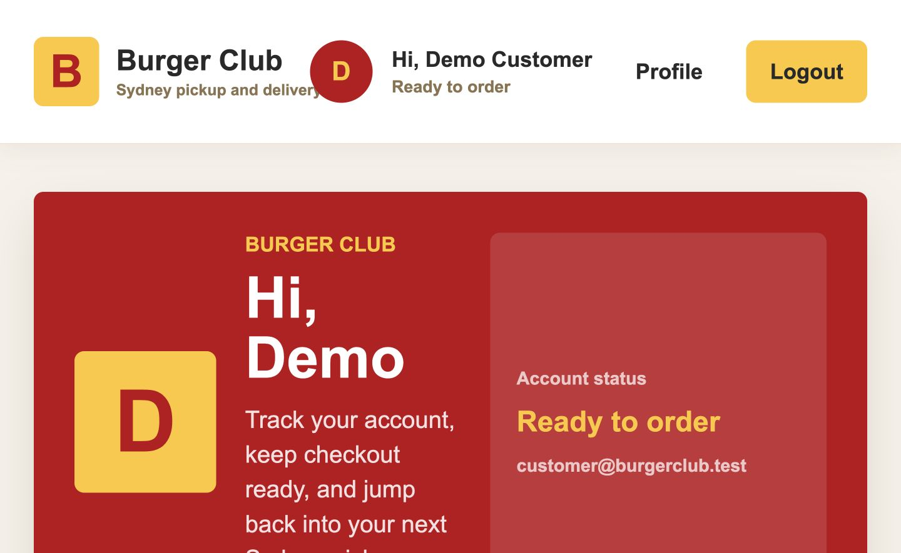

# Burger Club

Burger Club is a Sydney-focused full-stack restaurant ordering platform. It
models a realistic local burger shop workflow: customers browse an AUD menu,
validate cart totals against the backend, pay with Stripe Checkout, and track
recent orders while staff manage orders and menu changes.

- **Live Demo:** [https://burger-vert.vercel.app](https://burger-vert.vercel.app)
- **Backend API:** [https://burger-rmc0.onrender.com](https://burger-rmc0.onrender.com)

> **Note:** The backend is hosted on Render's free tier, so the first request
> may take a few seconds while the service wakes up.

## Portfolio Highlights

- Built a production-style MERN ordering system for a Sydney restaurant concept
  with AUD cents-based pricing, customer checkout, staff workflows, and deployed
  live demo.
- Implemented Stripe Checkout with webhook signature verification and
  idempotent order payment updates so payment state is controlled by trusted
  backend events.
- Designed an authentication flow with JWT access tokens, HttpOnly refresh
  cookies, refresh-token rotation, CSRF origin/header checks, password hashing,
  email verification, Google OAuth, and rate-limited auth routes.
- Added backend cart quote validation and menu-version checks to prevent stale
  client prices from being used during checkout.
- Deployed the live app with Vercel, Render, MongoDB Atlas, Resend, and Stripe,
  with an optional AWS deployment path documented for S3, CloudFront, ECR, ECS
  Fargate, and an Application Load Balancer.

## Tech Stack

| Area     | Stack                                                                             |
| -------- | --------------------------------------------------------------------------------- |
| Frontend | React 19, TypeScript, React Router, CSS Modules, Create React App                 |
| Backend  | Node.js, Express, TypeScript, Mongoose, Zod                                       |
| Database | MongoDB                                                                           |
| Payments | Stripe Checkout, Stripe webhook signature verification                            |
| Auth     | Email/password, Google OAuth, JWT access tokens, HttpOnly refresh-cookie sessions |
| Testing  | Jest, React Testing Library, ts-jest                                              |
| Tooling  | Stripe CLI, npm scripts                                                           |

## Core Features

- Sydney-local restaurant ordering experience with AUD pricing.
- Menu feed with search, sorting, pagination, and menu version polling.
- Backend cart validation so checkout totals are calculated server-side.
- Stripe Checkout flow with signed webhook handling.
- Payment lifecycle updates for success, failed, cancelled, and repeated webhook events.
- Order history and profile page payment-return handling.
- Customer authentication with Google OAuth and refresh-token recovery.
- Production security headers, API rate limiting, and stricter authentication
  throttling.
- Staff/admin order console and menu management.
- Staff invitation flow with token validation.
- Email workflows for verification, reset password, and order confirmation.
- Seed scripts for local menu and demo users.

## Frontend Highlights

- In-memory access token storage, with refresh tokens kept out of JavaScript in
  HttpOnly cookies.
- API wrapper compatible with refresh-cookie sessions, CSRF headers, request
  timeouts, retry handling, and automatic refresh-and-retry on eligible `401`
  responses.
- Single-flight refresh logic so concurrent expired requests share one refresh
  request instead of racing the rotated refresh token.
- Debounced cart quote validation that keeps checkout totals aligned with
  backend-calculated AUD cents.
- Menu-version conflict handling to detect stale cart prices and refresh quotes
  before checkout.
- Local cart persistence so customers can leave and return without losing their
  basket.
- Role-aware customer/admin routing and auth state managed through a dedicated
  auth provider.

## Live Demo Notes

- Stripe runs in test mode and does not create real charges.
- Google sign-in is available in the deployed app.
- SMS codes are printed locally in development; no production SMS provider is
  configured.
- Apple sign-in is shown as a future provider but is not implemented yet.

## Screenshots

| Menu                                      | Login                                       | Profile                                         |
| ----------------------------------------- | ------------------------------------------- | ----------------------------------------------- |
|  |  |  |

## Local Setup

### 1. Install dependencies

```bash
cd backend
npm install

cd ../frontend
npm install
```

### 2. Configure environment variables

```bash
cp backend/.env.example backend/.env
```

Update `backend/.env` with your MongoDB URI and a `JWT_SECRET` containing at
least 32 characters. Add Stripe test keys when testing the payment flow.

For local Stripe webhooks, run this in a separate terminal:

```bash
stripe listen --forward-to localhost:5001/api/stripe/webhook
```

Copy the printed `whsec_...` value into `STRIPE_WEBHOOK_SECRET`, then restart
the backend.

### 3. Seed local data

```bash
cd backend
npm run seed:meals
npm run seed:demo-users
```

For an existing database created before integer money fields were introduced:

```bash
cd backend
npm run migrate:money-cents
```

### 4. Run the app

Terminal 1:

```bash
cd backend
npm run dev
```

Terminal 2:

```bash
cd frontend
npm start
```

Open [http://localhost:3000](http://localhost:3000).

## Environment Configuration

Use [`backend/.env.example`](backend/.env.example) as the source of truth for
backend configuration. Local development requires `MONGO_URI` and a
`JWT_SECRET` with at least 32 characters. Backend URL settings have local
defaults and can be overridden when needed.

Stripe Checkout requires `STRIPE_SECRET_KEY` and `STRIPE_WEBHOOK_SECRET`.
Google sign-in requires `GOOGLE_CLIENT_ID` and `GOOGLE_CLIENT_SECRET`. Email
delivery through Resend is optional.

The frontend currently uses relative `/api` requests. Create React App proxies
those requests to the local backend during development, while Vercel rewrites
them to the deployed Render API in production.

## Optional AWS Deployment

The current live demo uses Vercel and Render. An optional AWS path is documented
in [`docs/aws-deployment.md`](docs/aws-deployment.md) for deploying the frontend
to S3 + CloudFront and the backend to ECS Fargate through ECR and an Application
Load Balancer.

## Test Commands

```bash
cd backend
npm run lint
npm run typecheck
npm run format:check
npm test
npm run build

cd ../frontend
npm run lint
npm run typecheck
npm run format:check
CI=true npm test -- --watchAll=false
npm run build
```

Run `npm run format` in either project to format its source files, or
`npm run format:check` to check formatting without changing files.

## Architecture

The frontend is split around pages, domain stores, API clients, and reusable UI
components. Cart state lives in a dedicated cart provider, while quote validation
and menu-version polling are handled through cart-specific hooks. Profile and
auth pages keep request orchestration inside page hooks so UI components stay
focused on rendering.

The backend follows a route-controller-service-repository shape. Controllers
handle HTTP input and status codes, services own business rules, repositories
wrap MongoDB access, and Zod schemas validate request bodies. Stripe webhooks are
mounted before JSON parsing with `express.raw()` so signature verification uses
the original request body.

The backend applies Helmet security headers, limits JSON request bodies to
100 KB, and rate-limits the general API. Login and verification attempts use a
stricter limiter, while higher-cost actions such as signup, password recovery,
and SMS delivery use the strictest limiter. Stripe webhooks remain outside the
general limiter so valid provider retries are not blocked.

Payment truth comes from Stripe webhooks, not the frontend success redirect. The
frontend only improves the return experience by showing payment state and
clearing the cart after a successful return.

All monetary values are stored and transferred as integer AUD cents
(`priceCents`, `subtotalCents`, `totalCents`, and `amountCents`). Stripe receives
the validated integer `priceCents` value directly as its minor-unit amount.

## Demo Accounts

The deployed live demo can use the accounts below. For local development, run
`npm run seed:demo-users` in `backend` first.

| Role     | Email                      | Password      |
| -------- | -------------------------- | ------------- |
| Customer | `customer@burgerclub.test` | `Burger#2026` |
| Admin    | `admin@burgerclub.test`    | `Burger#2026` |

## Stripe Test Card

Use Stripe test mode card `4242 4242 4242 4242` with any future expiry date and
any three-digit CVC.
