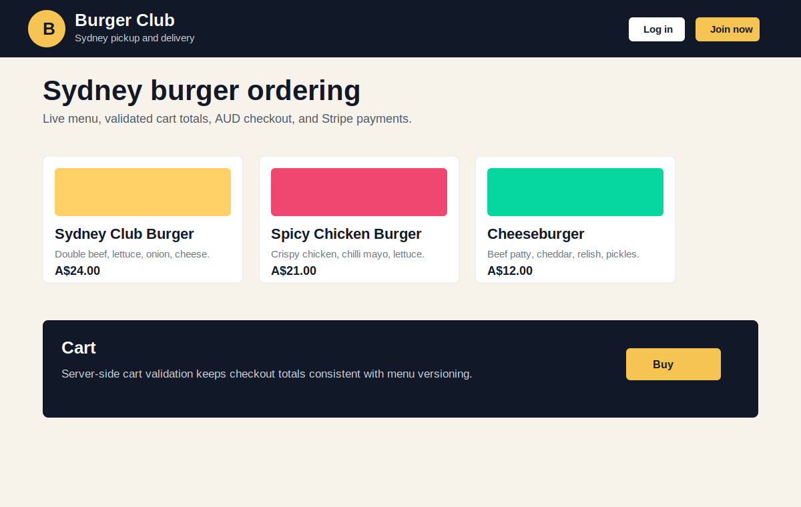
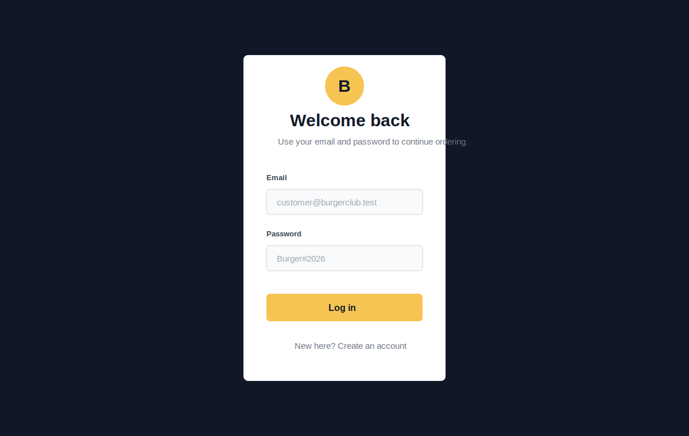
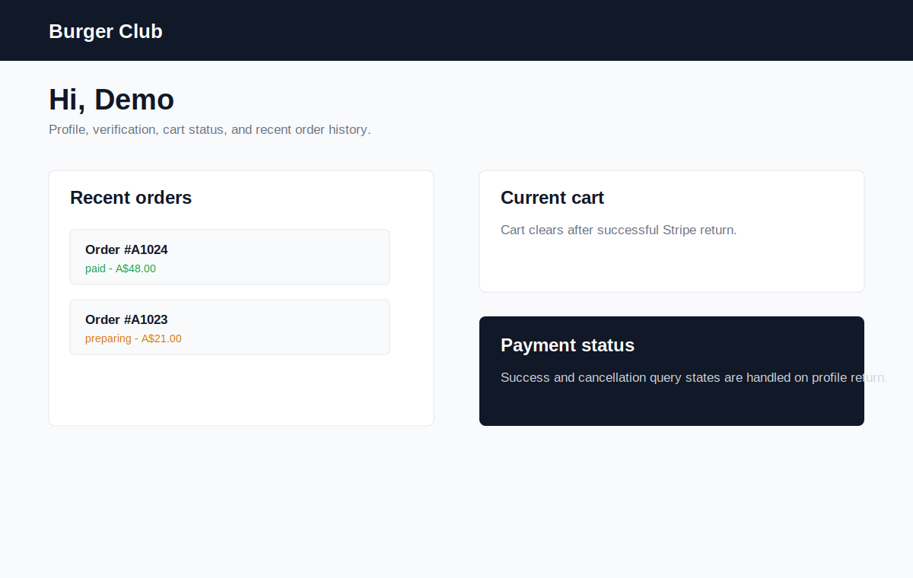

# Burger Club

Burger Club is a Sydney-focused full-stack restaurant ordering platform for
pickup and delivery. It models a realistic local burger shop workflow: customers
browse an AUD menu, validate cart totals against the backend, pay with Stripe
Checkout, and track recent orders while staff manage orders and menu changes.

- **Live Demo:** [https://burger-vert.vercel.app](https://burger-vert.vercel.app)
- **Backend API:** [https://burger-rmc0.onrender.com](https://burger-rmc0.onrender.com)

> **Note:** The backend is hosted on Render's free tier, so the first request
> may take a few seconds while the service wakes up.

## Tech Stack

| Area     | Stack                                                                          |
| -------- | ------------------------------------------------------------------------------ |
| Frontend | React 19, TypeScript, React Router, CSS Modules, Create React App              |
| Backend  | Node.js, Express, TypeScript, Mongoose, Zod                                    |
| Database | MongoDB                                                                        |
| Payments | Stripe Checkout, Stripe webhook signature verification                         |
| Auth     | JWT access tokens, refresh-cookie sessions, email/password, OAuth-ready config |
| Testing  | Jest, React Testing Library, ts-jest                                           |
| Tooling  | Stripe CLI, npm scripts                                                        |

## Core Features

- Sydney-local restaurant ordering experience with AUD pricing.
- Menu feed with search, sorting, pagination, and menu version polling.
- Backend cart validation so checkout totals are calculated server-side.
- Stripe Checkout flow with signed webhook handling.
- Payment lifecycle updates for success, failed, cancelled, and repeated webhook events.
- Order history and profile page payment-return handling.
- Customer authentication with refresh-token recovery.
- Staff/admin order console and menu management.
- Staff invitation flow with token validation.
- Email workflows for verification, reset password, and order confirmation.
- Seed scripts for local menu and demo users.

## Screenshots

| Menu                                      | Login                                       | Profile                                         |
| ----------------------------------------- | ------------------------------------------- | ----------------------------------------------- |
|  |  |  |

## Local Setup

### 1. Install dependencies

```bash
cd backend
npm install

cd ../frontend
npm install
```

### 2. Configure environment variables

```bash
cp backend/.env.example backend/.env
cp frontend/.env.example frontend/.env
```

Update `backend/.env` with your MongoDB URI and Stripe test keys.
`JWT_SECRET` is required and must contain at least 32 characters.

For local Stripe webhooks, run this in a separate terminal:

```bash
stripe listen --forward-to localhost:5001/api/stripe/webhook
```

Copy the printed `whsec_...` value into `STRIPE_WEBHOOK_SECRET`, then restart
the backend.

### 3. Seed local data

```bash
cd backend
npm run seed:meals
npm run seed:demo-users
```

For an existing database created before integer money fields were introduced:

```bash
cd backend
npm run migrate:money-cents
```

### 4. Run the app

Terminal 1:

```bash
cd backend
npm run dev
```

Terminal 2:

```bash
cd frontend
npm start
```

Open [http://localhost:3000](http://localhost:3000).

## Environment Example

Backend:

```env
PORT=5001
MONGO_URI=mongodb://127.0.0.1:27017/burger-club
# Required: at least 32 characters
JWT_SECRET=replace-with-a-long-random-secret
FRONTEND_URL=http://localhost:3000
API_URL=http://localhost:5001
STRIPE_SECRET_KEY=sk_test_xxx
STRIPE_WEBHOOK_SECRET=whsec_xxx
STRIPE_SUCCESS_URL=http://localhost:3000/profile?payment=success
STRIPE_CANCEL_URL=http://localhost:3000/profile?payment=cancelled
```

Frontend:

```env
REACT_APP_API_URL=http://localhost:5001
REACT_APP_ADMIN_EMAILS=admin@example.com
```

## Test Commands

```bash
cd backend
npm run lint
npm run typecheck
npm test
npm run build

cd ../frontend
npm run lint
npm run typecheck
CI=true npm test -- --watchAll=false
npm run build
```

Run `npm run format` in either project to format its source files, or
`npm run format:check` to check formatting without changing files.

## Architecture

The frontend is split around pages, domain stores, API clients, and reusable UI
components. Cart state lives in a dedicated cart provider, while quote validation
and menu-version polling are handled through cart-specific hooks. Profile and
auth pages keep request orchestration inside page hooks so UI components stay
focused on rendering.

The backend follows a route-controller-service-repository shape. Controllers
handle HTTP input and status codes, services own business rules, repositories
wrap MongoDB access, and Zod schemas validate request bodies. Stripe webhooks are
mounted before JSON parsing with `express.raw()` so signature verification uses
the original request body.

Payment truth comes from Stripe webhooks, not the frontend success redirect. The
frontend only improves the return experience by showing payment state and
clearing the cart after a successful return.

All monetary values are stored and transferred as integer AUD cents
(`priceCents`, `subtotalCents`, `totalCents`, and `amountCents`). Stripe receives
the validated integer `priceCents` value directly as its minor-unit amount.

## Demo Accounts

Run `npm run seed:demo-users` in `backend` first.

| Role     | Email                      | Password      |
| -------- | -------------------------- | ------------- |
| Customer | `customer@burgerclub.test` | `Burger#2026` |
| Admin    | `admin@burgerclub.test`    | `Burger#2026` |

## Stripe Test Card

Use Stripe test mode card `4242 4242 4242 4242` with any future expiry date and
any three-digit CVC.
