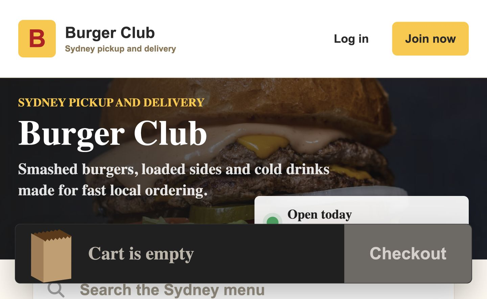
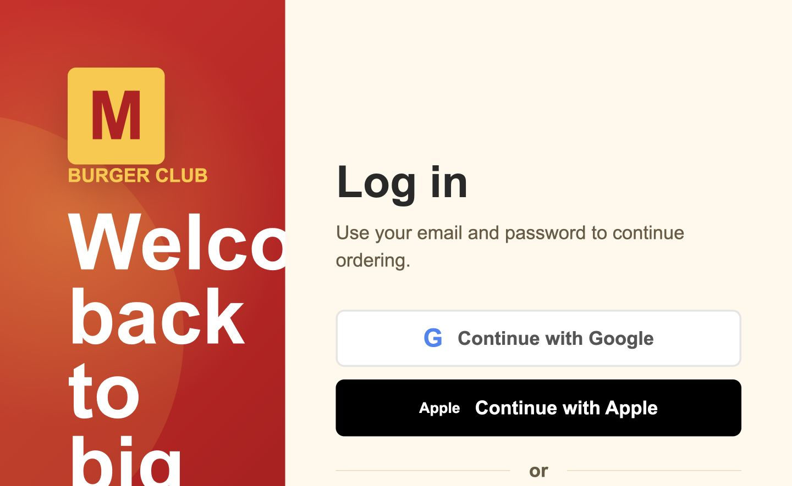
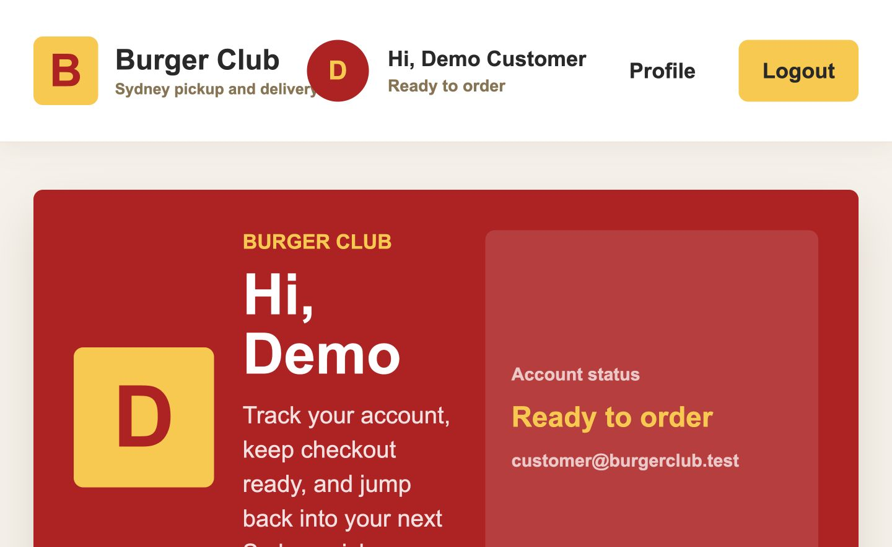
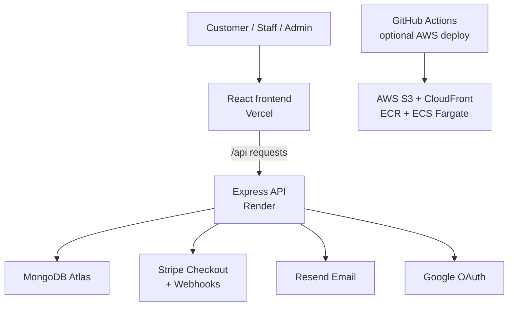

# Burger Club

Burger Club is a Sydney-focused full-stack restaurant ordering platform. It
models a realistic local burger shop workflow: customers browse an AUD menu,
validate cart totals against the backend, pay with Stripe Checkout, and track
recent orders while staff manage orders and menu changes.

- **Live Demo:** [https://burger-vert.vercel.app](https://burger-vert.vercel.app)
- **Backend API:** [https://burger-rmc0.onrender.com](https://burger-rmc0.onrender.com)

> **Note:** The backend is hosted on Render's free tier, so the first request
> may take a few seconds while the service wakes up.

## Portfolio Highlights

- Built a production-style MERN ordering system for a Sydney restaurant concept
  with AUD cents-based pricing, customer checkout, staff workflows, and deployed
  live demo.
- Implemented Stripe Checkout with webhook signature verification and
  idempotent order payment updates so payment state is controlled by trusted
  backend events instead of frontend return URLs.
- Designed an authentication flow with JWT access tokens, HttpOnly refresh
  cookies, refresh-token rotation, CSRF origin/header checks, password hashing,
  email verification, Google OAuth, and rate-limited auth routes.
- Added backend cart quote validation, menu-version checks, and order snapshots
  so Stripe line items are created from server-validated checkout data.
- Deployed the live app with Vercel, Render, MongoDB Atlas, Resend, and Stripe,
  with an optional AWS deployment path documented for S3, CloudFront, ECR, ECS
  Fargate, and an Application Load Balancer.

## Tech Stack

| Area     | Stack                                                                             |
| -------- | --------------------------------------------------------------------------------- |
| Frontend | React 19, TypeScript, React Router, CSS Modules, Create React App                 |
| Backend  | Node.js, Express, TypeScript, Mongoose, Zod                                       |
| Database | MongoDB                                                                           |
| Payments | Stripe Checkout, Stripe webhook signature verification                            |
| Auth     | Email/password, Google OAuth, JWT access tokens, HttpOnly refresh-cookie sessions |
| Testing  | Jest, React Testing Library, ts-jest                                              |
| Tooling  | Stripe CLI, npm scripts                                                           |

## System Architecture

```text
React customer app
  |-- REST API: menu, cart validation, checkout, profile orders
  |-- Socket.IO: menu version updates, customer order status updates
  v
Express API
  |-- Auth/RBAC: customer, staff, admin permissions
  |-- Order state machine: pending_payment -> paid -> preparing -> ready -> completed
  |-- Stripe webhook reconciliation
  |-- MongoDB aggregation for dashboard analytics
  |-- AI admin insight agent over verified backend data
  v
MongoDB Atlas
  |-- menu items
  |-- order snapshots
  |-- users, sessions, staff invites
  |-- audit logs and agent runs

Stripe Checkout -> signed webhook -> Express -> MongoDB -> Socket.IO events
Staff Kitchen Board -> status update -> Express -> MongoDB -> customer/admin events
```

## Core Features

- Sydney-local restaurant ordering experience with AUD pricing.
- Categorized menu feed with search, availability states, pagination, and menu
  version polling.
- Realistic restaurant menu coverage across burgers, sides, drinks, desserts,
  and combos, including featured and sold-out availability states.
- Backend cart validation so checkout totals are calculated server-side before
  order creation.
- Stripe Checkout flow with signed webhook handling and order-snapshot line
  items.
- Payment lifecycle updates for success, failed, cancelled, and repeated webhook events.
- Order history and payment-return handling that treats Stripe webhooks as the
  source of payment truth.
- Authenticated WebSocket admin events for order and menu changes, allowing the
  staff dashboard to refresh without manual reloads.
- Customer authentication with Google OAuth and refresh-token recovery.
- Production security headers, API rate limiting, and stricter authentication
  throttling.
- Staff/admin order console and menu management, including category and
  availability updates.
- Staff invitation flow with token validation.
- Email workflows for verification, reset password, and order confirmation.
- Seed scripts for local menu and demo users.

## Frontend Highlights

- In-memory access token storage, with refresh tokens kept out of JavaScript in
  HttpOnly cookies.
- API wrapper compatible with refresh-cookie sessions, CSRF headers, request
  timeouts, retry handling, and automatic refresh-and-retry on eligible `401`
  responses.
- Single-flight refresh logic so concurrent expired requests share one refresh
  request instead of racing the rotated refresh token.
- Debounced background cart quote refreshes that keep displayed totals aligned
  with backend-calculated AUD cents.
- Explicit user-action quote validation before checkout, with menu-version
  conflict handling and price-change notices.
- Local cart persistence so customers can leave and return without losing their
  basket.
- Role-aware customer/admin routing and auth state managed through a dedicated
  auth provider.

## Admin Analytics Foundation

The admin dashboard includes deterministic analytics over saved order records.
`GET /api/admin/dashboard/analytics?range=7d` uses MongoDB aggregation to
calculate revenue, order counts, average order value, category sales, top
items, lower-selling items, and payment status counts. These metrics are
computed by the backend rather than the AI layer, giving future admin AI
insights a verified data foundation to explain.

Analytics uses the restaurant's `Australia/Sydney` business day for today
metrics. Revenue, paid order counts, category sales, and item sales are
attributed by `payment.paidAt`, while order-count and payment-status funnel
metrics remain based on order creation time. Order item snapshots include
`categoryAtPurchase` so historical category reporting is not affected by later
menu edits, and lower-selling items include current menu items with zero sales.

The dashboard also exposes deterministic analytics alerts for high cancellation
rate, low paid-order rate, and revenue drops versus the previous period. Order
events can trigger `analytics:alert` over the authenticated admin WebSocket
channel so staff can see operational risks without refreshing the page.
Admins can then investigate an alert with the AI insight agent, which reloads
trusted analytics and active alert context before generating an evidence-based
recommendation. Follow-up questions reuse the same grounded alert investigation
endpoint instead of relying on unbounded chat memory. When a manager asks to see
orders by status, the agent can call a restricted `getOrdersByStatus` tool that
returns only operational order evidence, not customer private data.

Local demos can run `ALLOW_DEMO_ORDER_SEED=true npm run seed:demo-orders`
after seeding users and menu items to create realistic 30-day order history
for the analytics dashboard. The script replaces only orders whose
`checkoutIdempotencyKey` starts with `demo-order-`. Existing older order
records can be snapshot-backfilled by adding
`BACKFILL_EXISTING_ORDER_SNAPSHOTS=true`, which fills missing
`categoryAtPurchase`, `payment.paidAt`, `cancellationReason`, and
`cancelledAt` fields from existing order and menu data.

## Realtime Operations Flow

The backend exposes Socket.IO channels for public menu subscribers,
authenticated customers, and authenticated staff/admin users. Realtime events
use small payloads such as `order:paid`, `order:updated`, `order:cancelled`,
`menu:updated`, and `analytics:alert`.

```text
Customer checkout
  -> Stripe Checkout
  -> signed Stripe webhook
  -> backend marks order paid
  -> order:paid emitted to admins and the order owner's user room
  -> Kitchen Board updates and customer order page updates

Staff Kitchen Board
  -> Start preparing / Mark ready / Complete order
  -> backend validates the order state transition and version
  -> MongoDB order is updated
  -> order:updated emitted to admins and the customer

Admin disables customer
  -> user status becomes disabled
  -> active sockets in user:<id> are disconnected
```

Order pages use WebSocket payloads to update visible order status locally when
the order is already loaded. New orders, missing orders, and aggregate admin
dashboard data still trigger REST refreshes so MongoDB and backend analytics
remain the source of truth. Admin Orders and Admin Dashboard fall back to
30-second polling only when the authenticated realtime connection disconnects
or cannot be established. Public menu clients keep the same behavior for menu
version changes.

## AI Operations Insight Agent

The admin dashboard includes an AI operations insight agent that turns verified
analytics into operational attention, not unbounded chat. The backend first
computes metrics with MongoDB aggregation, detects active alerts, and exposes
restricted read-only tools such as `getPaymentStats`, `getItemPerformance`,
and `getOrdersByStatus`. The model can then explain what happened, cite the
evidence, describe a likely explanation only when the data supports it, and
recommend what the manager should check next.

```text
Orders in MongoDB
  -> deterministic aggregation tools
  -> analytics summary and active alerts
  -> selected read-only tools
  -> AI insight agent
  -> evidence-grounded operational attention cards
  -> follow-up alert and order investigation
  -> AgentRun logging for model, tool, latency, status, and cost estimate
```

Each insight run is recorded in an `AgentRun` document with the agent name,
prompt, selected backend tools, latency, status, and optional cost estimate.
The agent is intentionally constrained: it may recommend checks, but it does
not automatically change menu items, prices, payments, refunds, or orders. If
`OPENAI_API_KEY` is not configured, deterministic fallback insights still use
the same verified analytics and run logging, so the demo remains usable without
external AI spend.

## Live Demo Notes

- Stripe runs in test mode and does not create real charges.
- Google sign-in is available in the deployed app.
- Email/password and Google sign-in are available in the current auth surface.
- Apple sign-in is planned but not implemented yet.

## Screenshots

| Menu                                      | Login                                       | Profile                                         |
| ----------------------------------------- | ------------------------------------------- | ----------------------------------------------- |
|  |  |  |

## Local Setup

### 1. Install dependencies

```bash
cd backend
npm install

cd ../frontend
npm install
```

### 2. Configure environment variables

```bash
cp backend/.env.example backend/.env
```

Update `backend/.env` with your MongoDB URI and a `JWT_SECRET` containing at
least 32 characters. Add Stripe test keys when testing the payment flow.

For local Stripe webhooks, run this in a separate terminal:

```bash
stripe listen --forward-to localhost:5001/api/stripe/webhook
```

Copy the printed `whsec_...` value into `STRIPE_WEBHOOK_SECRET`, then restart
the backend.

### 3. Seed local data

```bash
cd backend
npm run seed:meals
npm run seed:demo-users
ALLOW_DEMO_ORDER_SEED=true npm run seed:demo-orders
```

For an existing database created before integer money fields were introduced:

```bash
cd backend
npm run migrate:money-cents
```

### 4. Run the app

Terminal 1:

```bash
cd backend
npm run dev
```

Terminal 2:

```bash
cd frontend
npm start
```

Open [http://localhost:3000](http://localhost:3000).

## Environment Configuration

Use [`backend/.env.example`](backend/.env.example) as the source of truth for
backend configuration. Local development requires `MONGO_URI` and a
`JWT_SECRET` with at least 32 characters. Backend URL settings have local
defaults and can be overridden when needed.

Stripe Checkout requires `STRIPE_SECRET_KEY` and `STRIPE_WEBHOOK_SECRET`.
Google sign-in requires `GOOGLE_CLIENT_ID` and `GOOGLE_CLIENT_SECRET`. Email
delivery through Resend is optional.

The frontend should set `REACT_APP_API_URL` to the backend origin, for example
`https://burger-rmc0.onrender.com`, when WebSocket admin events are enabled.
REST requests can still be routed through relative `/api` rewrites, but the
Socket.IO client needs a stable backend origin for the realtime connection.

## Optional AWS Deployment

The current live demo uses Vercel and Render. An optional AWS path is documented
in [`docs/aws-deployment.md`](docs/aws-deployment.md) for deploying the frontend
to S3 + CloudFront and the backend to ECS Fargate through ECR and an Application
Load Balancer.

The repository also includes an optional GitHub Actions workflow for deploying
the AWS stack. The workflow is manual-only and intended for learning or
practising AWS deployment, so paid resources such as an Application Load
Balancer or running ECS tasks are only created or updated intentionally.

## Technical Design Docs

The project includes design notes for the main engineering decisions:

- [`docs/architecture.md`](docs/architecture.md) explains the frontend/backend
  structure, permission model, data integrity rules, and observability approach.
- [`docs/auth-design.md`](docs/auth-design.md) covers refresh-token rotation,
  OAuth state handling, email verification, and permission-based access.
- [`docs/order-state-machine.md`](docs/order-state-machine.md) documents order
  transitions, permission rules, optimistic concurrency, and failure cases.
- [`docs/stripe-webhook-design.md`](docs/stripe-webhook-design.md) explains
  webhook signature verification, idempotency, payment matching, and late event
  handling.
- [`docs/deployment.md`](docs/deployment.md) summarizes the production topology,
  domains, environment variables, webhooks, and operational checks.

## Test Commands

```bash
cd backend
npm run lint
npm run typecheck
npm run format:check
npm test
npm run build

cd ../frontend
npm run lint
npm run typecheck
npm run format:check
CI=true npm test -- --watchAll=false
npm run build
```

Run `npm run format` in either project to format its source files, or
`npm run format:check` to check formatting without changing files.

## Architecture


```mermaid
flowchart TD
  user["Customer / Staff / Admin"] --> frontend["React frontend<br/>Vercel"]
  frontend -->|"/api requests"| api["Express API<br/>Render"]
  api --> mongo["MongoDB Atlas"]
  api --> stripe["Stripe Checkout<br/>+ Webhooks"]
  api --> resend["Resend Email"]
  api --> google["Google OAuth"]

  github["GitHub Actions<br/>optional AWS deploy"] --> aws["AWS S3 + CloudFront<br/>ECR + ECS Fargate"]
```

The frontend is split around pages, domain stores, API clients, and reusable UI
components. Cart state lives in a dedicated cart provider, while silent quote
refreshes, user-triggered quote validation, and menu-version polling are handled
through cart-specific hooks. Profile and auth pages keep request orchestration
inside page hooks so UI components stay focused on rendering.

The backend follows a route-controller-service-repository shape. Controllers
handle HTTP input and status codes, services own business rules, repositories
wrap MongoDB access, and Zod schemas validate request bodies. Stripe webhooks are
mounted before JSON parsing with `express.raw()` so signature verification uses
the original request body.

The backend applies Helmet security headers, limits JSON request bodies to
100 KB, and rate-limits the general API. Login and verification attempts use a
stricter limiter, while higher-cost actions such as signup, password recovery,
and email verification use the strictest limiter. Stripe webhooks remain outside
the general limiter so valid provider retries are not blocked.

Payment truth comes from Stripe webhooks, not the frontend success redirect. The
frontend payment-return page validates the returned order id format and only
routes the user to the relevant order page; order status is read back from the
backend.

Menu images are stored as paths or URLs on each menu item. Demo assets live in
`frontend/public/img/meals` and are served by the frontend deployment; production
image uploads would normally use object storage or a hosted image service rather
than the Vercel or Render filesystem.

All monetary values are stored and transferred as integer AUD cents
(`priceCents`, `subtotalCents`, `totalCents`, and `amountCents`). Stripe receives
the validated integer `priceCents` value directly as its minor-unit amount.

## Demo Accounts

The deployed live demo can use the accounts below. For local development, run
`npm run seed:demo-users` in `backend` first.

| Role     | Email                      | Password      |
| -------- | -------------------------- | ------------- |
| Customer | `customer@burgerclub.test` | `Burger#2026` |
| Admin    | `admin@burgerclub.test`    | `Burger#2026` |

## Stripe Test Card

Use Stripe test mode card `4242 4242 4242 4242` with any future expiry date and
any three-digit CVC.
