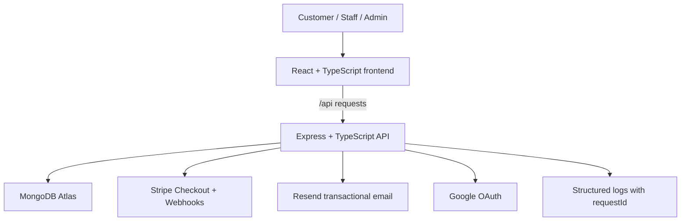

# Architecture Design

## Problem

Burger Club is a full-stack restaurant ordering system. The application needs to
support customer checkout, staff order fulfillment, admin menu operations,
payments, email workflows, and deployed environments without letting frontend
state become the source of truth for money, roles, or payment status.

## Goals

- Keep business rules on the backend.
- Keep frontend state responsive without trusting it for security decisions.
- Make checkout totals deterministic by storing money as integer AUD cents.
- Separate customer, staff, and admin workflows through permissions.
- Make production debugging possible with request-scoped errors and logs.
- Keep the system small enough for a portfolio project, but structured like a
  real service.

## High-Level System

## Backend Layers

The backend follows a route-controller-service-repository shape:

- Routes attach authentication, permission, and validation middleware.
- Controllers translate HTTP input into service calls and response status codes.
- Services own business rules such as checkout validation, order transitions,
  permissions, audit logs, and Stripe payment state.
- Repositories wrap Mongoose queries so service code is not tied to controller
  details.
- Zod schemas validate request bodies, params, and query strings.

This keeps security-sensitive logic out of React and away from route handlers
that are easy to overgrow.

## Frontend Layers

The frontend is organized around:

- API clients in `src/api`.
- Auth and cart providers for app-wide state.
- Page hooks for request orchestration.
- Components focused on rendering and interaction.
- Permission guards around admin routes.

The frontend can optimistically update UI, but the backend remains authoritative.
For example, order status updates are rolled back if the API returns a conflict.

## Permission Model

The system keeps simple roles for users, but authorization decisions are made
with permissions.

Current permissions include:

- `create_order`
- `view_own_orders`
- `view_orders`
- `manage_orders`
- `update_order_status`
- `manage_menu`
- `manage_staff`
- `manage_customers`
- `view_audit_logs`

This makes the code easier to extend later for roles such as manager,
kitchen_staff, support, or delivery_staff without rewriting every route guard.

## Data Integrity Rules

- Money is stored and transferred as integer cents.
- Menu changes bump `menuVersion`.
- Cart validation checks current menu data before checkout.
- Orders store item snapshots so old orders are not changed by later menu edits.
- Stripe webhooks, not frontend redirects, determine payment truth.
- Order status changes go through a state machine.
- Concurrent order updates use a version field and return `409 Conflict` when
  the client is stale.

## Observability

Every request receives a `requestId`. The backend returns it in error responses
and logs structured error details with the same id. The frontend preserves the
id on `ApiError`, so UI messages can include a reference when a user reports a
problem.

## Key Tradeoffs

- MongoDB transactions are not required for the portfolio deployment, so the
  checkout flow is transaction-like rather than a multi-document transaction.
- Roles still exist because they are useful for login redirects and UI grouping,
  but permission checks are the enforcement boundary.
- Stripe Checkout is used instead of a custom card form to keep PCI handling out
  of this project.
