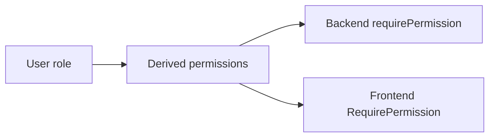

# Authentication And Authorization Design

## Problem

The app needs customer login, admin/staff access, Google OAuth, email
verification, and secure session recovery without storing long-lived tokens in
JavaScript.

## Design

Authentication uses two tokens:

- Short-lived JWT access token stored in React memory.
- Long-lived refresh token stored in an HttpOnly cookie.

The frontend sends the access token in the `Authorization` header. When an
eligible request returns `401`, the API wrapper performs one refresh request and
retries the original request.

## Refresh Token Rotation

Refresh sessions are rotated on every refresh:

1. The active refresh token hash is atomically consumed.
2. A replacement refresh session is created in the same session family.
3. Reusing the old token inside the grace window is treated as concurrent
   refresh.
4. Reusing it after the grace window revokes the active family.

The frontend also uses a single-flight `refreshPromise`, so concurrent expired
requests share one refresh operation instead of racing each other.

## OAuth

Google OAuth start creates a provider URL and stores a random state value in an
HttpOnly cookie. The callback verifies the state before creating an auth
session.

The frontend callback does not trust user data from the URL. It refreshes the
session and uses the user returned by the backend.

## Email Verification

Signup creates a user and sends a verification email with a short-lived token.
Checkout requires a verified email or verified contact before payment. If email
delivery fails, the frontend sends the user to the verification page with an
informational state and offers a resend path.

Email verification, password reset, SMS verification, and staff invites are
modeled as one-time credentials. Their service flows do not first load a token
document and then save it later. Instead, repository methods consume credentials
with conditional atomic updates such as `consumeEmailVerificationToken`,
`consumePasswordResetToken`, `consumeSmsCode`, and staff invite claim methods.
Concurrent reuse attempts therefore match no active credential after the first
successful request.

## Authorization

Roles are still stored as `customer`, `staff`, and `admin`, but route access is
checked through permissions.

Backend route examples:

- `manage_menu` protects menu create/update/delete.
- `manage_staff` protects staff invitation management.
- `view_orders` protects admin/staff order views.
- `update_order_status` protects fulfillment updates.
- `view_audit_logs` protects audit log access.

The frontend mirrors these guards for user experience, but backend permission
checks are the security boundary.

## Disabled Accounts

Access tokens are JWTs, but authenticated API routes are not fully stateless.
The `authenticate` middleware verifies the JWT, then loads the current user from
MongoDB and rejects users whose `status` is `disabled`.

That means admin account disable takes effect on the next protected API request,
even if the existing short-lived access token has not expired yet. Refresh
rotation also loads the current user and rejects disabled accounts, so disabled
users cannot obtain replacement access tokens.

The tradeoff is an extra user lookup on authenticated routes. Burger Club keeps
that lookup because immediate account disable is more important for admin/staff
operations than avoiding one indexed read. The system does not currently use a
Redis denylist or token-version claim.

## Failure Cases

- Missing refresh token: backend returns `401` and clears the refresh cookie.
- Refresh token reuse: backend revokes the active session family.
- Replacement session creation failure after the previous refresh token is
  consumed: the current implementation fails closed and the user must
  authenticate again. A production multi-document deployment could wrap refresh
  rotation in a MongoDB transaction to remove this partial-success window.
- Disabled user: refresh and authenticated routes reject the session.
- Invalid OAuth state: callback fails before creating a session.
- Staff manually entering admin-only URLs: frontend blocks where possible;
  backend still returns `403`.

## Testing Strategy

- Refresh rotation tests cover missing tokens, reuse detection, concurrent
  refresh, disabled users, and returned permissions.
- Route/middleware tests verify permission boundaries.
- Frontend route guard tests verify redirects and loading states.
