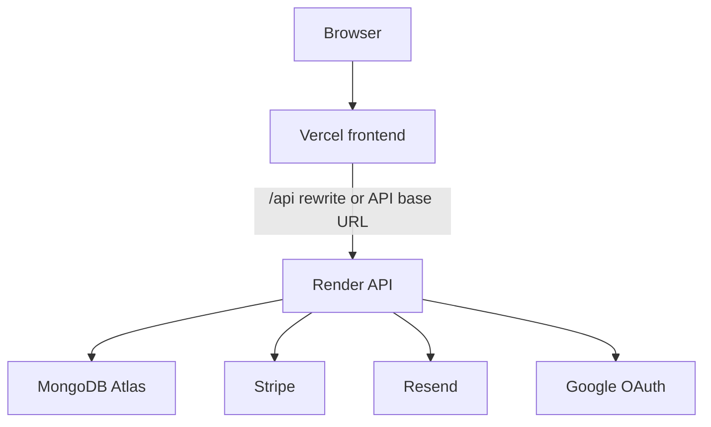

# Deployment Design

## Production Topology

The current production deployment uses:

- Vercel for the React frontend.
- Render for the Express API.
- MongoDB Atlas for persistence.
- Resend for transactional email.
- Stripe test mode for Checkout and webhook events.
- Google Cloud OAuth credentials for Google sign-in.



## Domains

The frontend can be served from the Vercel domain or the custom domain. The API
can use the Render service domain or an API custom domain. OAuth callback URLs
must match the backend URL used to generate the provider redirect.

Recommended production shape:

- Frontend: `https://www.sydneyburger.com`
- API: `https://api.sydneyburger.com`
- Google callback:
  `https://api.sydneyburger.com/api/auth/oauth/google/callback`

## Environment Variables

Backend variables should be configured on Render:

- `MONGO_URI`
- `JWT_SECRET`
- `FRONTEND_URL`
- `TRUSTED_ORIGINS`
- `GOOGLE_CLIENT_ID`
- `GOOGLE_CLIENT_SECRET`
- `PUBLIC_API_URL`
- `STRIPE_SECRET_KEY`
- `STRIPE_WEBHOOK_SECRET`
- `RESEND_API_KEY`
- `EMAIL_FROM`

Frontend variables should be configured on Vercel:

- `REACT_APP_API_URL` when direct API calls should use a custom backend domain.

Infrastructure identifiers should use GitHub Actions variables or secrets
instead of being hardcoded in workflow files.

## CORS And CSRF

The backend validates trusted origins and requires CSRF protection headers for
state-changing API requests. `TRUSTED_ORIGINS` supports multiple domains so
production, preview, and localhost environments can be handled explicitly.

## Webhooks

Stripe webhooks should point directly to the backend:

```text
https://api.sydneyburger.com/api/stripe/webhook
```

Local development can use Stripe CLI:

```bash
stripe listen --forward-to localhost:5001/api/stripe/webhook
```

## Optional AWS Path

The repository also documents an AWS deployment path in
`docs/aws-deployment.md`. That path uses S3 + CloudFront for the frontend and
ECR + ECS Fargate + ALB for the backend.

The AWS workflow is optional. The live portfolio deployment can stay on Vercel
and Render.

## Operational Checks

After deployment:

1. Visit the frontend domain.
2. Verify `/api/health` through the configured frontend/API path.
3. Confirm menu items load.
4. Test Google OAuth from the final production domain.
5. Create a test Stripe checkout and confirm the webhook marks the order paid.
6. Register a new email and confirm Resend delivers verification email.
7. Check an intentional API error includes `requestId`.
