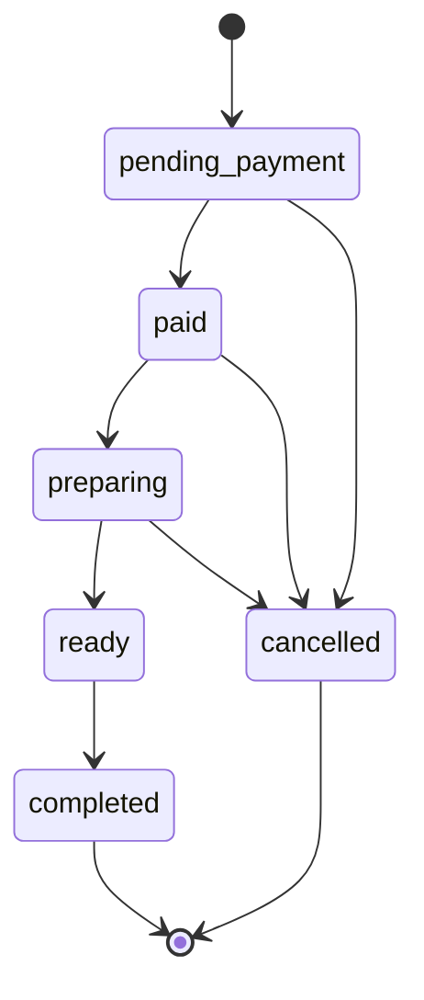

# Order State Machine Design

## Problem

Restaurant orders have a real lifecycle. A simple editable enum is not enough,
because it would allow invalid states such as `completed -> preparing` or
`cancelled -> paid`.

The system needs clear business rules for staff fulfillment, admin cancellation,
Stripe payment events, and concurrent updates.

## Design

All manual order status updates go through an explicit state machine.



Allowed transitions:

| Current status    | Allowed next statuses       |
| ----------------- | --------------------------- |
| `pending_payment` | `paid`, `cancelled`         |
| `paid`            | `preparing`, `cancelled`    |
| `preparing`       | `ready`, `cancelled`        |
| `ready`           | `completed`                 |
| `completed`       | none                        |
| `cancelled`       | none                        |

## Permission Rules

- Stripe orders can only become `paid` from trusted Stripe webhook handling.
- Staff can fulfill paid orders through the kitchen workflow.
- Admin can manage broader order operations such as cancellation before the
  terminal states.
- Completed and cancelled orders are terminal.

## API Contract

Order status updates require the next status and the client-known version:

```json
{
  "status": "preparing",
  "version": 3
}
```

The backend checks:

1. The order exists.
2. The user has permission to make this transition.
3. The transition is allowed by the state machine.
4. The submitted version matches the current order version.

If the version is stale, the API returns `409 Conflict`.

## Concurrency Strategy

Mongoose optimistic concurrency is enabled for orders. The public order payload
exposes the current version. When two staff members edit the same order from the
same old state, only the first write succeeds. The second write receives a
conflict instead of silently overwriting the newer state.

The frontend applies optimistic UI for status changes, then rolls back when the
API returns an error or conflict.

## Failure Cases

- Invalid transition: return `400`.
- Missing permission: return `403`.
- Stale version: return `409`.
- Stripe order manually marked paid: reject and wait for webhook.
- Late failed Stripe event for an already paid order: ignore terminal paid state.

## Auditability

Status changes record audit logs with actor, entity, before value, after value,
and timestamp. This gives admins a trace of who moved an order through the
workflow.

## Testing Strategy

- Unit tests cover allowed and rejected transitions.
- Order service tests cover permission boundaries, Stripe-paid protection,
  cancellation rules, and version conflict behavior.
- Frontend tests cover available next statuses and optimistic conflict
  rollback behavior.
