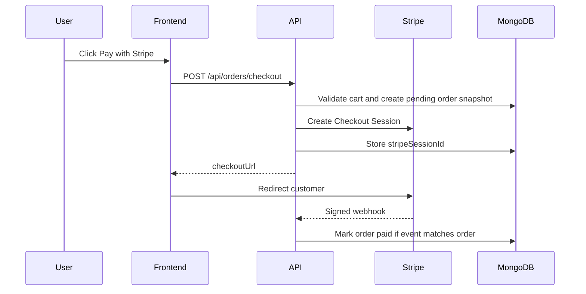

# Stripe Webhook Design

## Problem

Payment redirects are not reliable proof of payment. A customer can close the
browser, refresh the success page, or return before Stripe webhook processing is
complete.

The backend must treat Stripe webhooks as the source of truth while protecting
against duplicate events, out-of-order events, and mismatched payment details.

## Checkout Flow

## Webhook Verification

The webhook route uses `express.raw()` before JSON parsing so Stripe signature
verification receives the exact raw body. Events with missing or invalid
signatures are rejected before any order mutation.

## Idempotency

Stripe can send the same event more than once. The backend records each event in
a Stripe event collection:

- `stripeEventId`
- `eventType`
- `status`
- `orderId`
- `receivedAt`
- `lastReceivedAt`
- `attempts`
- `processedAt`
- `lastError`

Processing flow:

1. Verify the Stripe signature.
2. Atomically claim the event id for processing.
3. If it was already processed or is still inside an active processing lease,
   return `200`.
4. Apply the order update.
5. Mark the event as processed.
6. If processing fails, mark the event failed and return through error handling.

The claim step uses a conditional database update so only one request can move a
retryable event into `processing`. Failed events can be retried, and
`processing` events older than the lease window can be reclaimed. This prevents
a worker crash from leaving an event permanently stuck while still avoiding
duplicate work for fresh in-flight deliveries.

## Payment Matching

For `checkout.session.completed`, the backend checks that:

- `payment_status` is `paid`.
- `amount_total` matches `order.totalCents`.
- `currency` is `aud`.
- `metadata.orderId` matches the order.
- `client_reference_id` matches the order.

This prevents a valid Stripe event from updating the wrong order or the wrong
amount.

## Out-Of-Order Events

Stripe events can arrive late or out of order. The order service protects paid
orders from being downgraded by later failed or expired events. For example,
when an order is already paid, a late `checkout.session.expired` event does not
change it to cancelled.

## Frontend Return Experience

The frontend success redirect is treated as a user experience signal only. The
profile page can show a confirming state and reload the order, but payment state
still comes from the backend after webhook processing.

## Testing Strategy

- Controller tests verify signature handling and duplicate event skipping.
- Repository tests verify event claiming and processed status updates.
- Order service tests verify amount/currency/order matching and terminal-state
  guards for late failed events.
